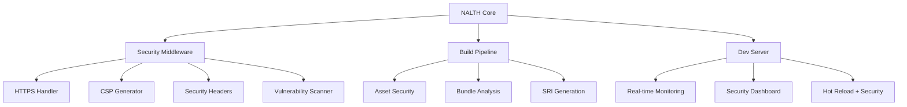

 [](https://www.nalthjs.com) 
# Introducing NALTH.JS

**The Security-First Web Framework**

Welcome to NALTH, the world's first security-first web development framework. Built on TypeScript and powered by a security-enhanced Vite.js foundation, NALTH makes enterprise-grade security effortless while maintaining lightning-fast development speeds.

---

## 🚀 Quick Navigation

<div class="grid grid-cols-1 md:grid-cols-2 lg:grid-cols-3 gap-6 my-8">

### [🏁 Getting Started](./guide/getting-started.md)

**New to NALTH?** Start here! Learn how to create your first secure application in under 2 minutes.

- [Installation](./guide/installation.md)
- [Your First Project](./guide/first-project.md)
- [CLI Reference](./reference/cli.md)

### [🔧 Configuration](./guide/configuration.md)

**Customize your security.** Learn how to configure NALTH for your specific security requirements.

- [Security Configuration](./guide/security-config.md)
- [HTTPS Setup](./guide/https-setup.md)
- [Environment Variables](./reference/env-variables.md)

### [🛡️ Security Features](./security/overview.md)

**Enterprise-grade protection.** Explore NALTH's comprehensive security features and best practices.

- [HTTPS by Default](./security/https.md)
- [Content Security Policy](./security/csp.md)
- [Security Headers](./security/headers.md)
- [Vulnerability Scanning](./security/auditing.md)

### [📚 API Reference](./api/overview.md)

**Complete API documentation.** Detailed reference for all NALTH APIs, plugins, and configuration options.

- [Configuration API](./api/config.md)
- [Security API](./api/security.md)
- [Plugin API](./api/plugins.md)
- [Build API](./api/build.md)

### [🎯 Examples](./examples/overview.md)

**Learn by doing.** Real-world examples and templates for common use cases.

- [React Security App](./examples/react-security.md)
- [Vue.js Enterprise](./examples/vue-enterprise.md)
- [Node.js API Security](./examples/node-api.md)
- [Full-Stack Security](./examples/full-stack.md)

### [🏢 Enterprise](./guide/enterprise.md)

**Production-ready security.** Advanced features for enterprise environments and compliance.

- [OWASP Compliance](./security/owasp.md)
- [SOC2 Guidelines](./security/soc2.md)
- [GDPR Compliance](./security/gdpr.md)
- [Monitoring & Alerts](./guide/monitoring.md)

</div>

---

## 🌟 What Makes NALTH Special?

### ⚡ **Zero-Config Security**

```bash
# Create a secure app with one command
npx create-nalth my-secure-app --template nalth-react

# Security features work out of the box:
# ✅ HTTPS with auto-generated certificates
# ✅ Content Security Policy auto-generation
# ✅ Security headers configuration
# ✅ Real-time vulnerability scanning
```

### 🔒 **Enterprise-Grade Protection**

- **OWASP Top 10 Protection** - Built-in defenses against the most critical security risks
- **Real-time Security Dashboard** - Monitor threats and security posture in real-time
- **Automated Vulnerability Scanning** - Continuous dependency and code security auditing
- **Compliance Ready** - SOC2, GDPR, and enterprise security standards support

### 🚀 **Developer Experience First**

- **100% Vite.js Compatibility** - All existing Vite plugins and configurations work unchanged
- **TypeScript Native** - Full type safety with comprehensive TypeScript support
- **Hot Reload with Security** - Lightning-fast development with security monitoring
- **Beautiful Security UI** - Professional security dashboards and monitoring interfaces

### 📊 **Real-Time Security Monitoring**

- **Interactive Security Dashboard** - Live metrics and threat visualization
- **CSP Violation Tracking** - Real-time Content Security Policy monitoring
- **Dependency Audit Alerts** - Instant notifications for vulnerable dependencies
- **Security Event Logging** - Comprehensive audit trails and security events

---

## 📖 Documentation Sections

### 🎓 **Learning Path**

**Beginner → Intermediate → Advanced**

1. **[Getting Started](./guide/getting-started.md)** - Install NALTH and create your first secure app
2. **[Core Concepts](./guide/core-concepts.md)** - Understand NALTH's security-first architecture
3. **[Security Features](./security/overview.md)** - Learn about built-in security protections
4. **[Configuration Guide](./guide/configuration.md)** - Customize NALTH for your needs
5. **[Plugin Development](./guide/plugin-development.md)** - Build security-focused plugins
6. **[Production Deployment](./guide/deployment.md)** - Deploy secure applications to production

### 🎯 **By Use Case**

<div class="grid grid-cols-1 md:grid-cols-2 gap-4 my-6">

#### **Frontend Applications**

- [React + Security](./examples/react-security.md)
- [Vue.js Enterprise](./examples/vue-enterprise.md)
- [Svelte Security](./examples/svelte-security.md)
- [Vanilla TypeScript](./examples/vanilla-security.md)

#### **Full-Stack Applications**

- [Node.js API Security](./examples/node-api.md)
- [Express.js + NALTH](./examples/express-security.md)
- [Authentication & Authorization](./examples/auth-security.md)
- [Database Security](./examples/database-security.md)

#### **Enterprise Features**

- [Multi-tenant Security](./examples/multi-tenant.md)
- [Microservices Security](./examples/microservices.md)
- [CI/CD Security Pipeline](./examples/cicd-security.md)
- [Monitoring & Alerting](./examples/monitoring.md)

</div>

### 🛡️ **Security-First Architecture**



---

## 🆘 Need Help?

### 📞 **Support Channels**

- **[GitHub Issues](https://github.com/nalikiru-dev/nalth.js/issues)** - Bug reports and feature requests
- **[Discussions](https://github.com/nalikiru-dev/nalth.js/discussions)** - Community support and questions
- **[Discord Server](https://discord.gg/nalth)** - Real-time community chat
- **[Stack Overflow](https://stackoverflow.com/questions/tagged/nalth)** - Technical Q&A with `nalth` tag

### 📚 **Additional Resources**

- **[Migration Guide](./guide/migration.md)** - Moving from Vite.js or other build tools
- **[Troubleshooting](./guide/troubleshooting.md)** - Common issues and solutions
- **[FAQ](./guide/faq.md)** - Frequently asked questions
- **[Changelog](./reference/changelog.md)** - Version history and updates

### 🔐 **Security Resources**

- **[Security Policy](https://github.com/nalikiru-dev/nalth.js/security/policy)** - Vulnerability reporting
- **[Security Advisories](./security/advisories.md)** - Security updates and alerts
- **[Best Practices](./security/best-practices.md)** - Security implementation guidelines
- **[Compliance Guides](./security/compliance.md)** - Industry standards and regulations

---

## 🤝 Contributing

NALTH is open source and we welcome contributions! Check out our:

- **[Contributing Guide](../CONTRIBUTING.md)** - How to contribute to NALTH
- **[Code of Conduct](../CODE_OF_CONDUCT.md)** - Community guidelines
- **[Development Setup](./guide/development.md)** - Setting up the development environment
- **[Architecture Guide](./guide/architecture.md)** - Understanding NALTH's internals

---

## 📄 License

NALTH is [MIT licensed](../LICENSE) - the same as Vite.js to maintain ecosystem compatibility.

---

<div class="text-center my-12">
  <h2>🚀 Ready to Build Secure Applications?</h2>
  <p class="text-lg text-gray-600 mb-6">
    Join thousands of developers who trust NALTH for enterprise-grade security
  </p>
  
  <div class="flex justify-center gap-4">
    <a href="./guide/getting-started.md" class="btn-primary">Get Started</a>
    <a href="./examples/overview.md" class="btn-secondary">View Examples</a>
    <a href="https://github.com/nalikiru-dev/nalth.js" class="btn-outline">GitHub</a>
  </div>
</div>

---

**NALTH**: Where Security Meets Speed. Built for the modern web. 🛡️⚡
